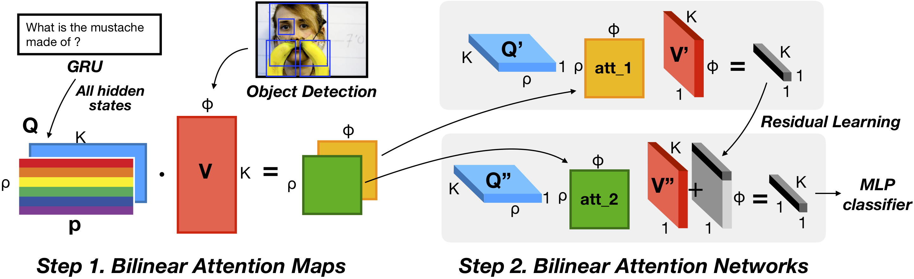

# Bilinear attention networks for visual question answering

This repository is the implementation of [Bilinear Attention Networks](http://arxiv.org/abs/1805.07932) for the visual question answering task. Our single model achieved **70.35** and an ensemble of 15 models achieved **71.84** (Test-standard, VQA 2.0). For the detail, please refer to our [technical report](http://arxiv.org/abs/1805.07932).

This repository is based on and inspired by @hengyuan-hu's [work](https://github.com/hengyuan-hu/bottom-up-attention-vqa). We sincerely thank for their sharing of the codes.



### Prerequisites

You may need a machine with 4 GPUs, 64GB memory, and PyTorch v0.3.1 for Python 3.

1. Install [PyTorch](http://pytorch.org/) with CUDA and Python 3.5.
2. Install [h5py](http://docs.h5py.org/en/latest/build.html).

### Preprocessing

Our implementation uses the pretrained features from [bottom-up-attention](https://github.com/peteanderson80/bottom-up-attention), the adaptive 10-100 features per image. In addition to this, the GloVe vectors. For the simplicity, the below script helps you to avoid a hassle.

All data should be downloaded to a `data/` directory in the root directory of this repository.

The easiest way to download the data is to run the provided script `tools/download.sh` from the repository root. If the script does not work, it should be easy to examine the script and modify the steps outlined in it according to your needs. Then run `tools/process.sh` from the repository root to process the data to the correct format.

For now, you should manually download for the below options (used in our best single model).

We use a part of Visual Genome dataset for data augmentation. The [image meta data](https://visualgenome.org/static/data/dataset/image_data.json.zip) and the [question answers](https://visualgenome.org/static/data/dataset/question_answers.json.zip) of Version 1.2 are needed to be placed in `data/`.

We use MS COCO captions to extract semantically connected words for the extended word embeddings along with the questions of VQA 2.0 and Visual Genome. You can download in [here](http://images.cocodataset.org/annotations/annotations_trainval2017.zip). Since the contribution of these captions is minor, you can skip the processing of MS COCO captions by removing `cap` elements in the `target` option in this [line](https://github.com/jnhwkim/ban-vqa/blob/master/dataset.py#L393).

Counting module ([Zhang et al., 2018](https://openreview.net/forum?id=B12Js_yRb)) is integrated in this repository as `counting.py` for your convenience. The source repository can be found in @Cyanogenoid's [vqa-counting](https://github.com/Cyanogenoid/vqa-counting).

### Training

```
python main.py --use_both True --use_vg True
```
to start training (the options for the train/val splits and Visual Genome to train, respectively). The training and validation scores will be printed every epoch, and the best model will be saved under the directory "saved_models". The default hyperparameters should give you the best result of single model, which is around **70.04** for test-dev split. 

### Validation

If you trained a model with the training split using
```
$ python3 main.py
```
then you can run `evaluate.py` with appropriate options to evaluate its score for the validation split.

### Pretrained model

We provide the pretrained model reported as the best single model in the paper (70.04 for test-dev, 70.35 for test-standard).

Please download the [link](https://drive.google.com/uc?export=download&id=1OGYxF5WY4uYc_6UobDjhrJIHkl2UGNct) and move to `saved_models/ban/model_epoch12.pth` (you may encounter a redirection page to confirm). The training log is found in [here](https://drive.google.com/uc?export=download&id=1sEa5bTMOFv_Xjo_A0xeNw379_Sljg9R_).

```
$ python3 test.py --label mytest
```

The result json file will be found in the directory `results/`.

### Troubleshooting

Please check [troubleshooting wiki](https://github.com/jnhwkim/ban-vqa/wiki/Troubleshooting) and [previous issue history](https://github.com/jnhwkim/ban-vqa/issues?utf8=✓&q=is%3Aissue).

### Citation

If you use this code as part of any published research, we'd really appreciate it if you could cite the following paper:

```
@article{Kim2018,
author = {Kim, Jin-Hwa and Jun, Jaehyun and Zhang, Byoung-Tak},
journal = {arXiv preprint arXiv:1805.07932},
title = {{Bilinear Attention Networks}},
year = {2018}
}
```

### License

MIT License
